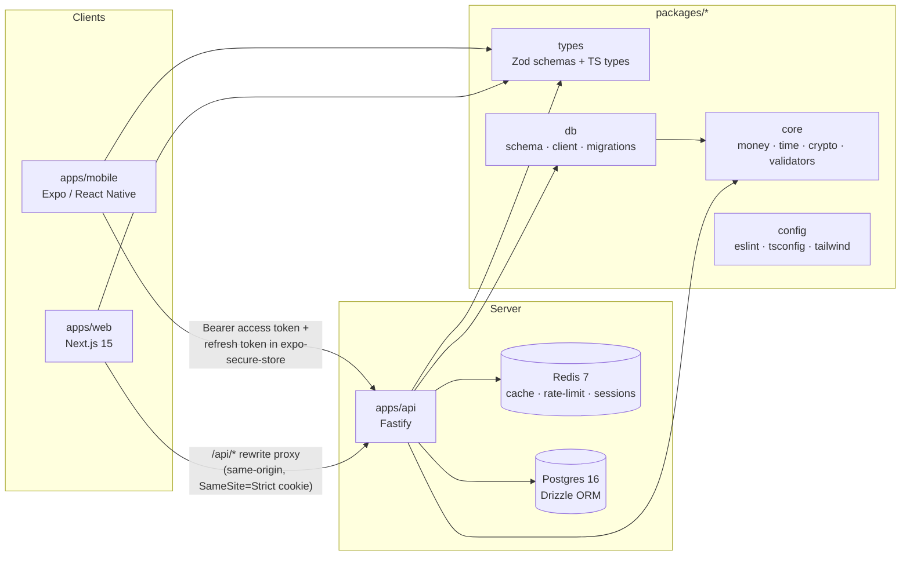

# Tradex

A stock broking platform for Indian markets (NSE/BSE), in the spirit of Zerodha Kite / Upstox.

**This is Phase 1 of 7: Foundation, Database & Authentication.** It covers the monorepo
scaffold, the full database schema, and a complete auth system (signup, OTP, login,
2FA, sessions, KYC intake). Trading, orders, charts, and live market data are out of
scope until later phases.

## Architecture



- **apps/api** — Fastify + Zod, argon2id password hashing, JWT access tokens (15 min)
  + rotating opaque refresh tokens (30 d, reuse-detection revokes the whole session
  family), TOTP 2FA via otplib, rate limiting via `@fastify/rate-limit` backed by Redis.
- **apps/web** — Next.js 15 App Router, dark-first Zerodha-adjacent UI, TanStack Query +
  Zustand, middleware-gated `/dashboard` and `/settings/*` (redirects to `/kyc` until
  verified). The browser only ever talks to its own origin (`/api/*`) — Next.js
  reverse-proxies to the real API — which is what makes the httpOnly
  `SameSite=Strict` refresh cookie viable and lets middleware read it.
- **apps/mobile** — Expo Router with `(auth)`/`(app)` route groups, tokens split
  between memory (access) and `expo-secure-store` (refresh), optional biometric
  unlock.
- **packages/core** — pure business logic, zero I/O, 100% unit-tested: money (bigint
  paise), NSE market hours, AES-256-GCM field encryption, Indian-market validators,
  OTP/backup-code generation, argon2id hashing.
- **packages/types** — Zod schemas + inferred TS types shared by every app; the single
  source of truth for request/response shapes.
- **packages/db** — Drizzle ORM schema, Postgres client, SQL migrations, seed script.

## Global rules (apply to every future phase)

1. **Money** — never `float`/`double`/`Number` for currency. Stored as `BIGINT` paise
   (₹1 = 100 paise) in the DB, bigint everywhere in code.
   `packages/core/src/money.ts` exports `toPaise()`, `toRupees()`, `formatINR()`,
   `addMoney()`, `subMoney()`, `mulMoney()` — all bigint-based, 100% test coverage.
   Quantities are `INTEGER`.
2. **Time** — every timestamp is `timestamptz`, stored and reasoned about in UTC.
   Rendered in IST (Asia/Kolkata) at the edges. `packages/core/src/market-time.ts`
   exports `isMarketOpen()` / `nextMarketOpen()` for NSE hours (09:15–15:30 IST,
   Mon–Fri) plus a `NSE_HOLIDAYS` stub array — replace with the authoritative NSE
   calendar before relying on it in production.
3. **IDs** — UUID v7 primary keys everywhere (time-sortable), generated in application
   code via the `uuidv7` package (Postgres 16 has no native `uuidv7()`).
4. **Audit** — every mutating endpoint writes a row to `audit_log`
   (`apps/api/src/lib/audit.ts`).
5. **Types** — TypeScript strict, no `any`, no non-null assertions, enforced by
   `packages/config/eslint-preset.js` with zero exceptions anywhere in the codebase
   (verified by grep, not just by the linter passing). Every request body, query, and
   param is Zod-validated at the API boundary via `fastify-type-provider-zod`.
6. **Encryption** — `packages/core/src/crypto.ts` implements AES-256-GCM
   `encryptField()`/`decryptField()`, keyed by `ENCRYPTION_KEY`. Used for PAN, bank
   account numbers, and broker tokens. Because GCM ciphertext is non-deterministic
   (random IV per call), a `UNIQUE` constraint can't be enforced on the ciphertext
   itself — `user_profiles.pan_hash` stores a deterministic `HMAC-SHA256(pan)`
   alongside the encrypted `pan` column purely for the one-PAN-per-account uniqueness
   check; it's never decrypted.
7. **Security** — argon2id password hashing, generic "invalid email or password" on
   auth failures (never reveal whether an identifier exists), 5 failed logins locks
   the *account* for 15 minutes (separate from the 10 req/min/IP rate limit), helmet +
   CORS allowlist, no stack traces in prod error responses.

## Repo structure

```
tradex/
  apps/
    api/          Fastify server — auth, 2FA, /me, KYC
    web/           Next.js 15 App Router
    mobile/        Expo Router
  packages/
    core/          Pure business logic (money, time, crypto, validators, otp, password)
    types/         Shared Zod schemas + TS types
    db/            Drizzle schema, client, migrations, seed
    config/        Shared eslint/tsconfig/tailwind presets
  docker-compose.yml
  .env.example
```

## Setup

Requires Node 20+, pnpm 9+, and Docker.

```bash
# 1. Install dependencies
pnpm install

# 2. Copy env vars and fill in real secrets for anything beyond local dev
cp .env.example .env
# ENCRYPTION_KEY: openssl rand -hex 32
# JWT_ACCESS_SECRET / JWT_REFRESH_SECRET: openssl rand -hex 64

# 3. Start Postgres + Redis
docker compose up -d
# Note: if port 5432 is already taken locally, this compose file maps Postgres to
# host port 5433 by default (POSTGRES_PORT in .env) — the container itself still
# listens on 5432 internally, only the host mapping differs.

# 4. Run migrations, then seed 3 test users
pnpm db:migrate
pnpm db:seed
```

Seeded users (password `Test@1234` for all three):

| Email                        | State                                  |
| ----------------------------- | --------------------------------------- |
| `verified.2fa@tradex.dev`    | ACTIVE, KYC verified, 2FA enabled       |
| `verified.no2fa@tradex.dev`  | ACTIVE, KYC verified, no 2FA            |
| `pending.kyc@tradex.dev`     | PENDING_KYC, KYC not started            |

```bash
pnpm dev          # api (:4000) + web (:3000) concurrently
pnpm dev:mobile    # Expo dev server (apps/mobile)

pnpm test          # vitest across every package (117 core + 29 api tests)
pnpm lint           # eslint across every package
pnpm typecheck       # tsc --noEmit across every package
```

## API surface (all under `/v1`)

```
POST   /auth/signup                POST   /2fa/setup
POST   /auth/verify-otp            POST   /2fa/enable
POST   /auth/resend-otp            POST   /2fa/disable
POST   /auth/login
POST   /auth/login/2fa             GET    /me
POST   /auth/refresh               PATCH  /me/settings
POST   /auth/logout
POST   /auth/forgot-password       POST   /kyc/submit
POST   /auth/reset-password        GET    /kyc/status
GET    /auth/sessions              POST   /kyc/upload
DELETE /auth/sessions/:id          PUT    /kyc/upload/:documentId
```

## Testing

- `packages/core` — Vitest, **100% branch/line/function coverage** enforced on
  `money.ts`, `market-time.ts`, and `validators.ts` (`pnpm --filter @tradex/core
  test:coverage`).
- `apps/api` — Supertest + Vitest integration tests for every auth endpoint, run
  against a **Testcontainers** Postgres (a real, ephemeral Postgres 16 container per
  test file, migrated with the same SQL used in production) plus the docker-compose
  Redis. Covers the full lifecycle: signup → OTP → login → refresh-rotation →
  reuse-detection, account lockout, 2FA setup/enable/backup-codes/disable, KYC
  submit/uniqueness, session listing/revocation.

## Known issues worth knowing about

- ~~Mixed React versions in one pnpm workspace~~ **Resolved.** `apps/web` originally
  ran React 19 while `apps/mobile` ran React Native's bundled React 18, and having two
  `@types/react` major-version lines in the same workspace caused TypeScript to
  occasionally refuse to unify two structurally identical types resolved through
  different packages (`TS2322`, *"Two different types with this name exist, but they
  are unrelated"*), worked around with a handful of narrowly-scoped `any` casts.
  React Native 0.76 (Expo SDK 52) has a **hard runtime peer requirement on React
  18.3.1** — not just a type mismatch, an actual constraint enforced by RN's renderer
  — and Next.js 15 officially supports `^18.2.0` as a peer (confirmed via its own
  `package.json`), so the fix was to unify the whole workspace on React 18.3.1 rather
  than try to reconcile two versions. This is pinned with pnpm `overrides`, declared
  in **both** supported locations because the location pnpm reads depends on its major
  version, and this repo's `packageManager` pins `pnpm@9.15.9`:

  - **`package.json` → `pnpm.overrides`** — the location pnpm **9.x** reads (verified
    empirically on 9.15.9 with a discriminator test: an override here is applied; the
    same override in `pnpm-workspace.yaml` is silently ignored, and 9.15.9 emits *no*
    "pnpm field is no longer read" warning).
  - **`pnpm-workspace.yaml` → `overrides`** — the location pnpm **10+** reads (settings
    moved there per <https://pnpm.io/settings>; on 10, the `package.json` `pnpm` field
    is deprecated and warns). Kept in sync so the override survives a pnpm 10 upgrade.

  Both carry identical values:
  ```yaml
  overrides:
    react: 18.3.1
    react-dom: 18.3.1
    "@types/react": 18.3.31
    "@types/react-dom": 18.3.7
  ```
  On the pinned pnpm 9.15.9 the `package.json` block is authoritative; if the toolchain
  is later bumped to pnpm 10 (update `packageManager` too), the `pnpm-workspace.yaml`
  block takes over and the now-redundant `package.json` `pnpm` field can be removed to
  silence pnpm 10's deprecation warning. Change both blocks together until then.
  With a single resolved instance of `react`/`react-dom`/`@types/react`/
  `@types/react-dom` workspace-wide (verified — only one entry of each under
  `node_modules/.pnpm`), every workaround was removable: the `unsafeChildren` helper
  in `apps/web/src/lib/utils.ts` is gone, all four `apps/web/src/components/ui/*`
  files are back to their natural, unrestricted prop types, and both `Suspense` usages
  (`(auth)/verify-otp`, `(auth)/reset-password`) are back to plain JSX instead of the
  `createElement` workaround. There is no longer any `any`, `@ts-expect-error`, or
  similar escape hatch anywhere in `apps/web` — confirmed by grep, not just typecheck.
  `pnpm typecheck`, `pnpm lint`, `next build`, and a live runtime smoke test (login →
  cookie-rotated dashboard access → KYC wizard → 2FA/sessions page, all against real
  Postgres/Redis) all pass clean on the unified version.
- **`apps/mobile` peer-dependency warnings (unrelated to the React version fix
  above).** `expo-router`/`nativewind` pull in `react-native-reanimated`/
  `react-native-worklets` versions that expect a newer React Native than Expo SDK 52
  ships; these are unmet *peers* on packages this codebase doesn't actually import,
  not resolution failures — `pnpm install` completes and `pnpm --filter
  @tradex/mobile typecheck`/`lint` are clean. (The React 18/19 split previously also
  showed up here as a `react-dom`/`react-helmet-async` peer warning; unifying on
  React 18.3.1 removed those two specifically — only the reanimated/worklets ones
  remain.) Since this environment has no iOS/Android simulator, the mobile app is
  verified by typecheck/lint only, not a real Metro/Expo Go run — treat that as the
  next thing to confirm in an environment that has one.
- **KYC verification is submit-only in Phase 1.** `POST /v1/kyc/submit` moves
  `kyc_status` to `SUBMITTED`; there's no endpoint yet to move it to `VERIFIED` (no
  ops/admin surface was in scope). `user.status` accordingly stays `PENDING_KYC` until
  a future phase adds that review flow.
- **`backup_codes_hash` on `users`.** Not in the literal schema given in the spec, but
  added because `POST /v1/2fa/enable` returning "8 single-use backup codes" is only
  meaningful if they're persisted and checkable later — see the comment on that column
  in `packages/db/src/schema.ts`.
